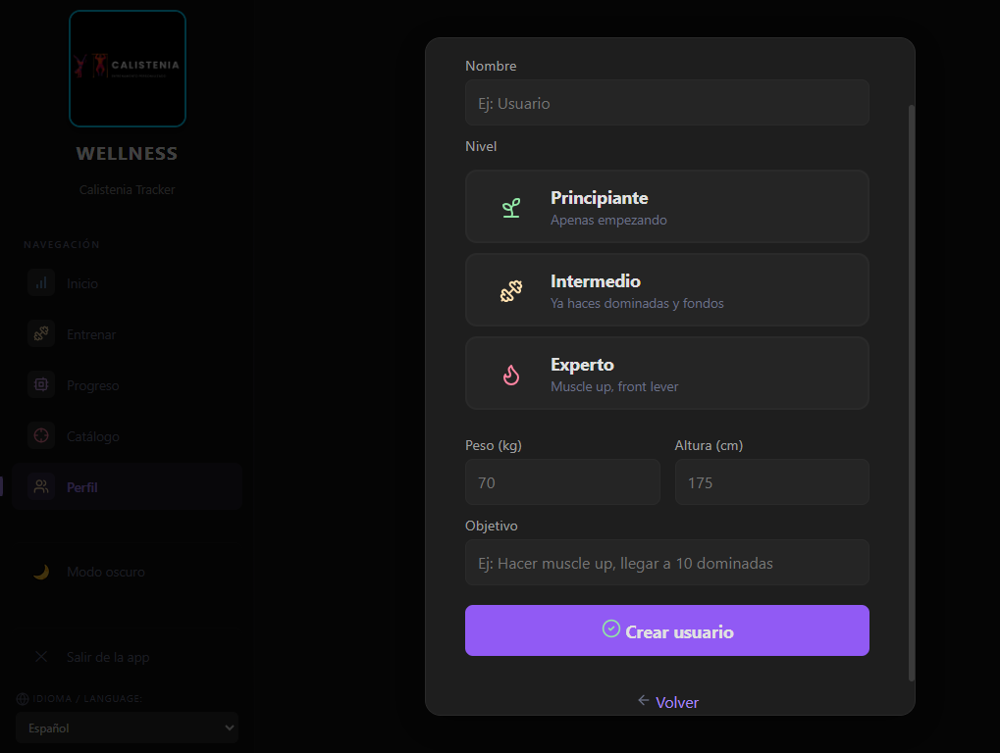
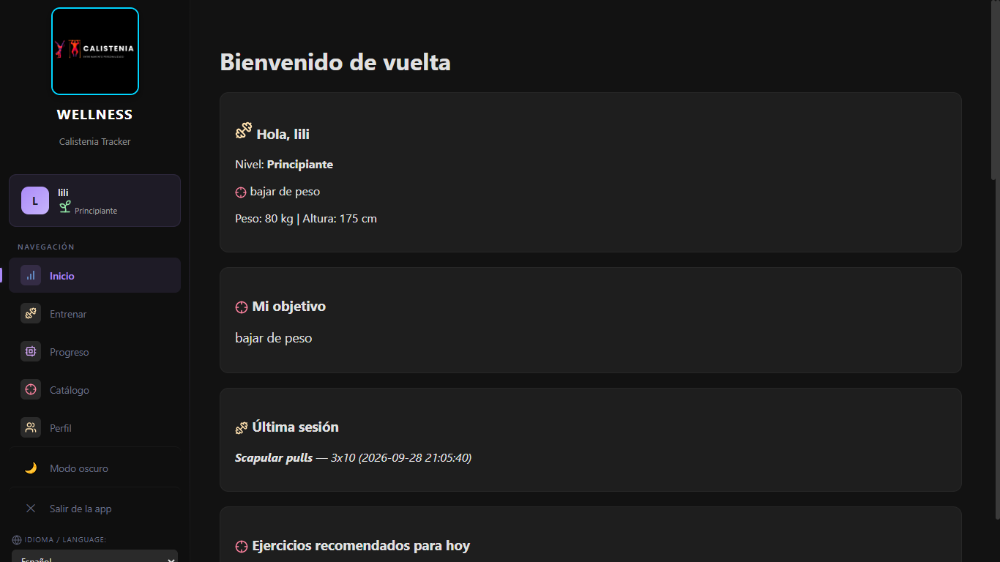
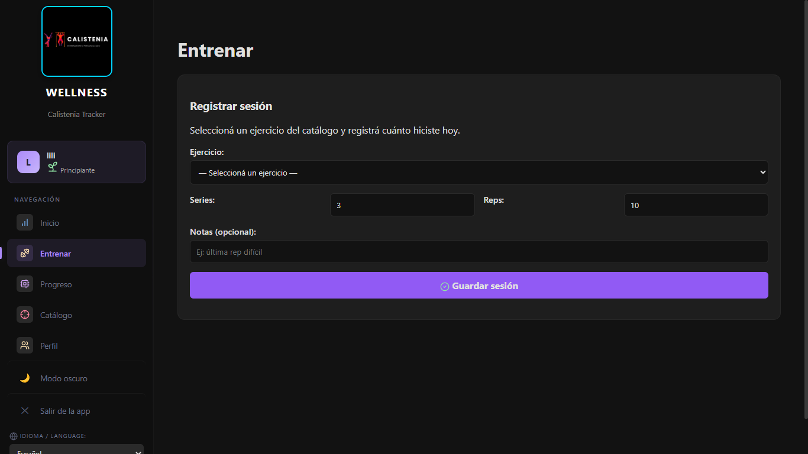
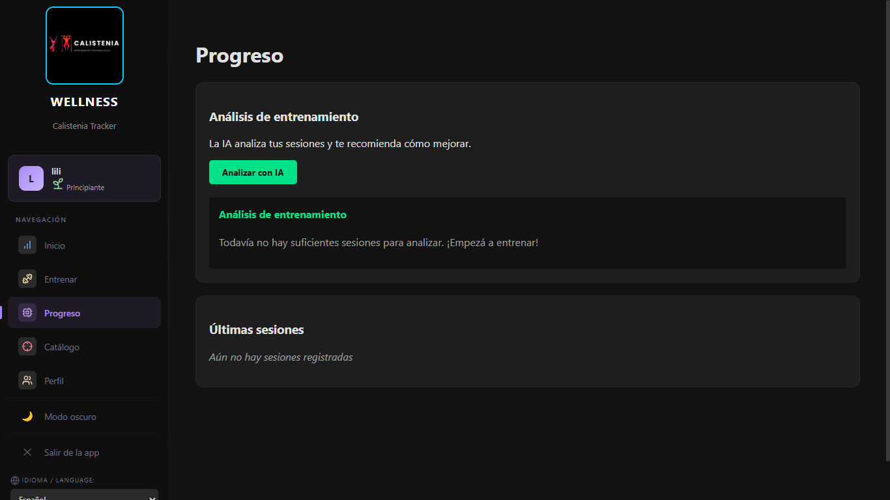
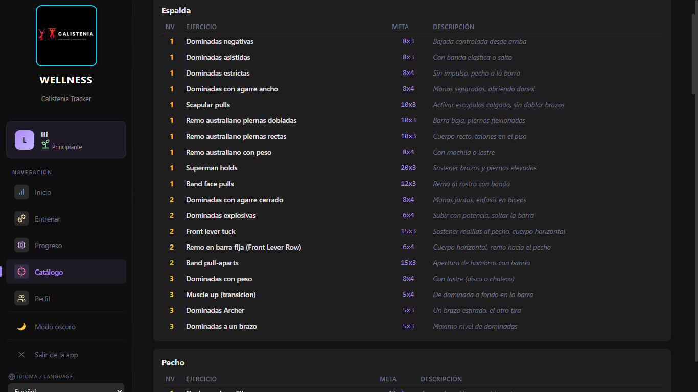
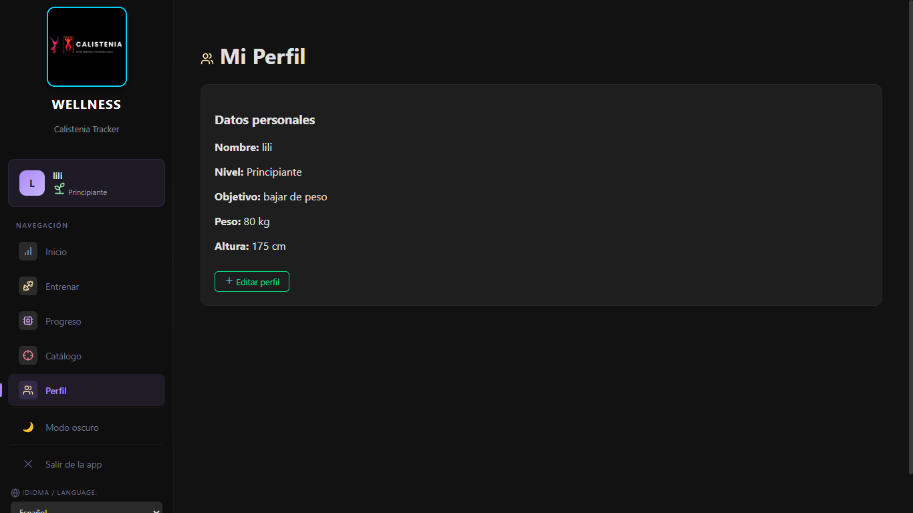
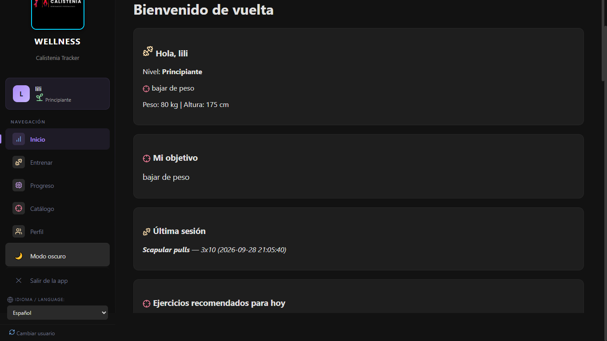
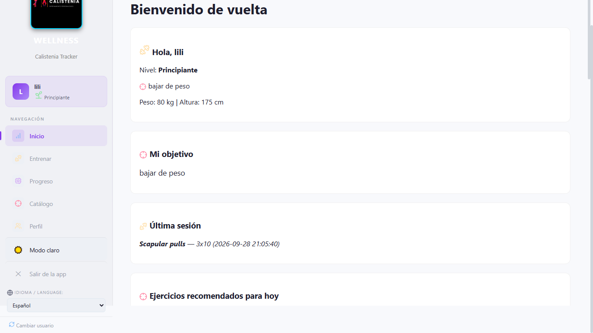
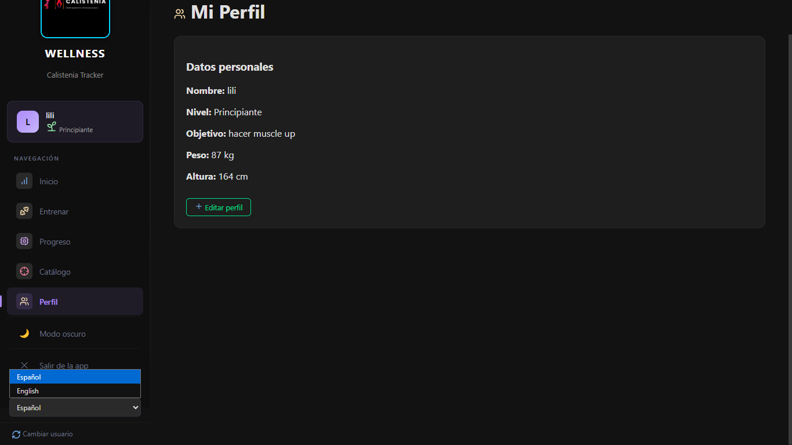

# Wellness - Calistenia Tracker

Aplicación de escritorio para registrar entrenamientos de calistenia y seguir la evolución del usuario: plan semanal, historial de sesiones y análisis de progreso con ayuda de IA. Funciona 100 % local, sin conexión a internet.

## Problema que aborda

Quien entrena calistenia sin un registro pierde la noción de su progreso: no sabe qué ejercicios hizo, cuándo, si cumplió las metas de su nivel, ni cuándo está listo para avanzar. Los métodos de papel o las apps genéricas no están pensados para la lógica de niveles y metas de este entrenamiento (series y repeticiones por ejercicio y por nivel).

## Área de wellness

Gestión de **rutinas de entrenamiento y seguimiento de la evolución del usuario**: ejercicio físico de calistenia, con registro de sesiones, planificación semanal, objetivos de niveles (Principiante, Intermedio, Experto), progreso y recomendaciones personalizadas.

## Objetivo

Brindar una herramienta local que permita:

- Registrar y gestionar usuarios con su nivel, peso, altura y objetivo personal.
- Consultar un catálogo de ejercicios de calistenia organizado por grupo muscular y nivel.
- Registrar sesiones de entrenamiento (series, repeticiones, notas) con valoración contra la meta del ejercicio.
- Visualizar el plan semanal y el resumen diario.
- Analizar el progreso y detectar estancamientos mediante IA en dos niveles: externa (OpenRouter) y local (reglas).
- Llevar un historial editable y un registro (log) de eventos de la aplicación.

## Funcionalidades principales

- **Login y registro** de usuarios (nombre, nivel, peso, altura, objetivo), con edición y eliminación de perfil.
- **Catálogo de ejercicios** de calistenia (100+), por grupo muscular, con nivel y meta de series/reps.
- **Registro de sesiones** con feedback automático contra la meta (cumplida o faltante).
- **Historial** de sesiones con edición y eliminación.
- **Plan semanal** (lunes a domingo) con grupos musculares, ejercicios recomendados del día y resumen diario con barra de progreso.
- **Análisis de progreso con IA**: observaciones, recomendaciones, técnicas, plan sugerido y ejercicios alternativos para estancamientos.
- Análisis **local por reglas**: ascenso de nivel (60 días, 15 sesiones, 60 % de metas), tendencia semanal de volumen y detección de estancamiento (3 fallos seguidos).
- **Tema claro/oscuro** y traducción **español/inglés**.

## Tecnologías utilizadas

- **Electron** 42 (`^42.0.1`): marco de escritorio (HTML, CSS y JavaScript, sin frameworks).
- **sql.js** (`^1.14.1`): SQLite compilado a JavaScript/WebAssembly; la base vive en `wellness.db`.
- **Node.js**: instalación de dependencias y ejecución.
- **OpenRouter** (IA externa, modelo `openrouter/free` por defecto) con fallback local sin internet.

## Arquitectura / diseño

Aplicación de escritorio con dos procesos (arquitectura clásica de Electron):

- **Proceso principal (`main.js`)**: ventana (pantalla completa), registro de eventos en `wellness.log`, carga de la API key desde `.env` y canales IPC (`log-write`, `ia-set-key`, `ia-analyze`, `app-close`). Todo acceso al sistema y la red pasa por aquí.
- **Renderer (`index.html` + `src/*.js`)**: interfaz en una sola página (SPA) con 5 secciones (Inicio, Entrenar, Progreso, Catálogo, Perfil) que se muestran de a una.
- **Persistencia**: SQLite embebida con `sql.js`; escrituras agrupadas en `database.js`. Tablas: `usuarios`, `progresiones`, `sesiones`, `plan_semanal`.
- **POO**: clases `Usuario`, `Ejercicio`, `Rutina` y `Sesion` definidas en `src/clases.js` e instanciadas al leer la base de datos (`database.js`).

Estructura del proyecto:

```
main.js                 Proceso principal: ventana, IPC y llamadas a la IA
index.html              Interfaz (una sola página)
src/
  app.js                Arranque, globals y tema
  auth.js               Login y registro
  clases.js             Clases POO (Usuario, Ejercicio, Rutina, Sesion)
  database.js           Base de datos SQLite (sql.js)
  ejercicios.js         Registro de sesiones
  historial.js          Historial (editar/eliminar)
  ia.js                 Análisis de IA (externa + local)
  navegacion.js         Cambio de secciones
  plan-semanal.js       Plan de la semana y resumen diario
  progresiones.js       Catálogo de ejercicios
  idiomas.js            Traducción español/inglés
styles/                 Hojas de estilo y temas
icons/                  Iconos de la app
```

## IA utilizada

Análisis de progreso con **dos niveles** (externa enriquece, local garantiza):

- **Externa (OpenRouter)**: con las últimas 15 sesiones y el catálogo, devuelve observaciones, recomendaciones, técnicas, un plan sugerido y **ejercicios alternativos** para los ejercicios estancados. Modelo por defecto `openrouter/free` (configurable con `OPENROUTER_MODEL`). Requiere API key (se carga por la interfaz o desde `.env`); si no hay key, no se detiene la app.
- **Local (reglas, siempre activa, sin internet)**: ascenso de nivel (60 días desde el registro + 15 sesiones + 60 % de metas cumplidas), tendencia semanal de volumen y detección de estancamiento con alternativas del mismo grupo muscular.

## Instalación y ejecución

Requisitos: **Node.js** (npm) instalado.

```bash
# 1. Clonar el repositorio
git clone <url-del-repositorio>
cd <carpeta-del-proyecto>

# 2. Instalar dependencias
npm install

# 3. Ejecutar
npm run start
```

Dependencias:

| Paquete  | Versión | Para qué |
|----------|---------|----------|
| electron | ^42.0.1 | Crear y ejecutar la ventana de la app |
| sql.js   | ^1.14.1 | Base de datos SQLite embebida |

### Configuración de la IA (opcional)

La IA externa necesita una API key de OpenRouter (gratuita en https://openrouter.ai/keys). Dos formas de cargarla:

- **Por la interfaz (recomendada):** en Progreso → Analizar, pegar la key y guardar. Queda en `localStorage`.
- **Archivo `.env`** en la raíz del proyecto:

  ```
  OPENROUTER_API_KEY=sk-or-v1-TU_CLAVE
  ```

El archivo `.env` está ignorado por `.gitignore` y no se sube al repositorio. Sin API key la app sigue funcionando con el análisis local.

### Datos y registro

- Base de datos: `wellness.db` (se crea sola al iniciar).
- Log de eventos: `wellness.log` (misma carpeta).

## Pruebas

Ver `documentacion.txt` (sección **Pruebas realizadas**). Se realizaron pruebas funcionales manuales de: arranque y creación de la base, registro/login, catálogo, registro de sesiones con feedback, historial (editar/eliminar), plan semanal, análisis de IA (externo y local), tema claro/oscuro, traducción y cierre correcto de la aplicación.

No se implementaron aún pruebas automatizadas (ver sección *Cierre*).

## Equipo

- LozanoPiton = Luis Lozano
- Liligs1 = Liliana Gutierrez

## Evidencias / capturas

### 1. Creación de Perfil


### 2. Panel Principal (Inicio)


### 3. Registro de Entrenamiento


### 4. Seguimiento de Progreso e IA


### 5. Catálogo de Ejercicios


### 6. Mi Perfil


### 7. Modo Oscuro


### 8. Modo Claro


### 9. Cambio de Idioma


## Estado del proyecto

Finalizado y funcional para uso local. La versión estable está en la rama `main`. Correcciones realizadas durante el desarrollo: manejo asíncrono del log, escrituras agrupadas a disco, reintentos de la llamada de red de la IA en Windows y contraste del tema claro.
