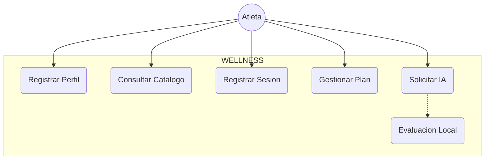
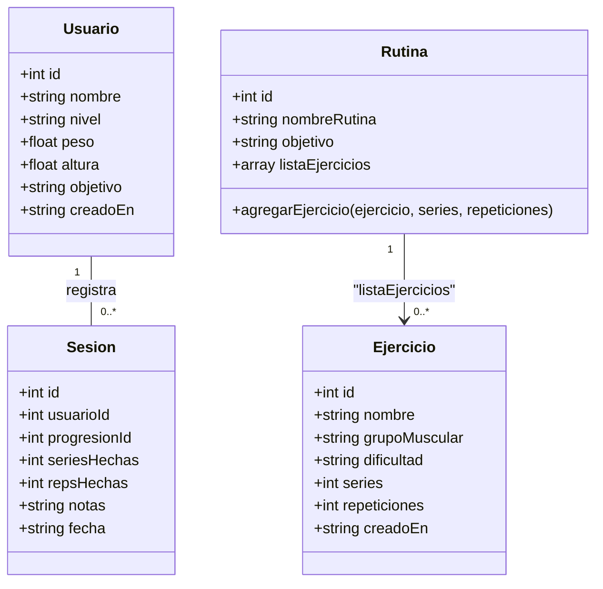

# 📐 Diseño UML y Arquitectura del Sistema

**Proyecto:** WELLNESS - Calistenia Tracker  
**Equipo #4:** Liliana Gutiérrez y Luis Lozano  

---

## 1. Diagrama de Casos de Uso
* **Actores:** Atleta (Usuario) y Proceso Principal (Electron Main Process).

## 2. Diagrama de Clases
Definición de clases orientadas a objetos tal como están implementadas en `src/clases.js` (constructores sin métodos de negocio; la lógica de persistencia vive en `src/database.js`):

## 3. Arquitectura del Sistema (Electron Multi-Process)
La aplicación utiliza la arquitectura nativa de Electron, dividida en dos capas principales, con canales IPC acotados:

1. **Proceso Principal (`main.js`):** Encargado de la gestión de la ventana, persistencia y auditoría (`wellness.log`, `wellness.db` vía `sql.js`), carga de claves API (desde `.env` o vía IPC) y las llamadas a la API de **OpenRouter**.

2. **Proceso Renderizador (`index.html` + `src/*.js`):** Interfaz gráfica SPA (Single Page Application) donde se procesa la interacción del usuario, estilos, navegación y lógica de presentación.

Los módulos del Renderizador se comunican con el proceso principal mediante **`ipcRenderer.invoke()`** a los canales registrados en `ipcMain` (`log-write`, `ia-set-key`, `ia-analyze`, `app-close`). En esta versión no se utiliza `preload.js` ni `contextBridge`: `nodeIntegration: true` y `contextIsolation: false` permiten el uso directo de `electron.ipcRenderer` desde los scripts del renderer (acceso a Node.js desde la UI). No se carga contenido remoto; toda la aplicación se sirve localmente.
