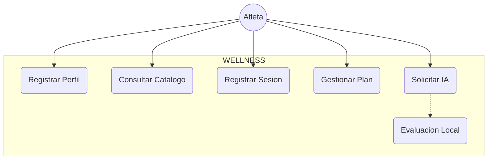
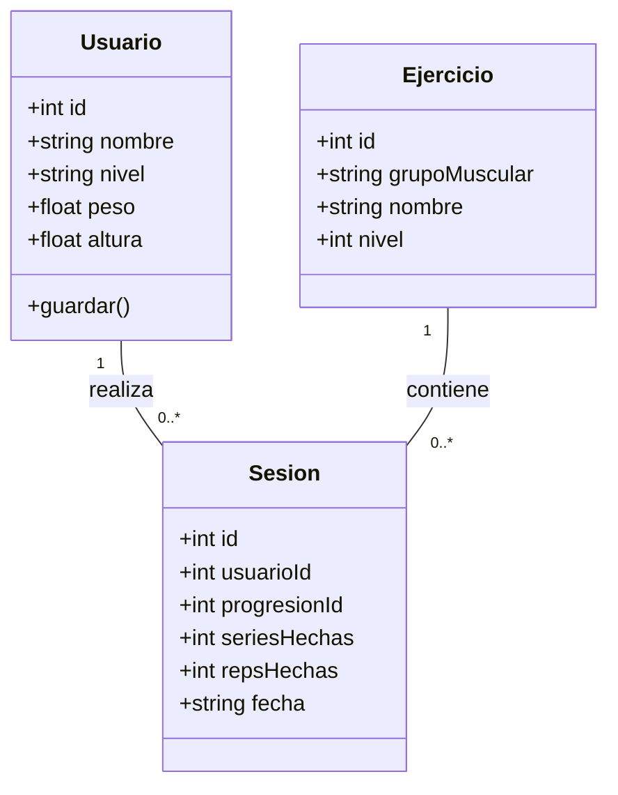

# 📐 Diseño UML y Arquitectura del Sistema

**Proyecto:** WELLNESS - Calistenia Tracker  
**Equipo #4:** Liliana Gutiérrez y Luis Lozano  

---

## 1. Diagrama de Casos de Uso
* **Actores:** Atleta (Usuario) y Proceso Principal (Electron Main Process).

## 2. Diagrama de Clases
Definición de clases orientadas a objetos (`src/clases.js`):

3. Arquitectura del Sistema (Electron Multi-Process)
La aplicación utiliza la arquitectura nativa de Electron, dividida en tres capas de responsabilidad:

1. Proceso Principal (main.js): Encargado de la gestión de la ventana, acceso al sistema de archivos local para la auditoría (wellness.log), carga de variables de entorno y llamadas directas a APIs de Inteligencia Artificial (OpenRouter).

2. Proceso Renderizador (index.html + src/*.js): Interfaz gráfica SPA (Single Page Application) donde se procesa la interacción del usuario, estilos y navegación sin recargar la página.

3. Puente IPC (contextBridge): Canalización segura de mensajes asíncronos mediante ipcMain e ipcRenderer, evitando exponer el motor Node.js directamente a la vista.
